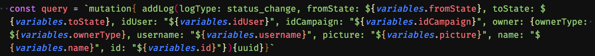

<h1 align="center">
	<br>
	
	<br>
	<br>
	<br>
</h1>

> Write GraphQL queries as objects instead of strings

<h1 align="center">
	<a href="https://www.codacy.com/app/khaosdoctor/gotql?utm_source=github.com&amp;utm_medium=referral&amp;utm_content=khaosdoctor/gotql&amp;utm_campaign=Badge_Grade">
		
	</a>
	<a href="https://opencollective.com/gotql" alt="Financial Contributors on Open Collective">
		
	</a>
	<a href="https://github.com/khaosdoctor/gotql/actions?query=workflow%3A%22Build+and+Publish%22">
		
	</a>
	<a href="https://standardjs.com">
		
	</a>
	<a href="https://snyk.io/test/github/khaosdoctor/gotql?targetFile=package.json">
		
	</a>
</h1>


This is a better implementation of the [GraphQL](https://github.com/facebook/graphql) query API via NodeJS, created as a wrapper of [Got](http://github.com/sindresorhus/got). It works like a transpiler, with a built in HTTPRequest Client (Got), allowing you to write your GraphQL queries as Javascript Objects instead of strings.

Built because manipulating strings is a real pain.

# Table of Contents

<!-- TOC -->

- [Table of Contents](#table-of-contents)
  - [Install](#install)
  - [Basic Usage](#basic-usage)
  - [What is it?](#what-is-it)
    - [Motivation](#motivation)
  - [API](#api)
    - [Option Object](#option-object)
    - [Returns](#returns)
  - [The JSON query format](#the-json-query-format)
    - [Description](#description)
    - [Examples](#examples)
      - [Simple query](#simple-query)
      - [Named query](#named-query)
      - [Query with simple args](#query-with-simple-args)
      - [Query with variables](#query-with-variables)
      - [Nested fields](#nested-fields)
      - [Enum args](#enum-args)
  - [Contributing to this project](#contributing-to-this-project)

<!-- /TOC -->

## Install

```sh
$ npm install gotql
```

Or

```sh
$ yarn install gotql
```

## Basic Usage

```js
const gotQl = require('gotql')

const query = {
  operation: {
    name: 'users',
    fields: ['name', 'age', 'id']
  }
}

const options = {
  headers: {
    "Authorization": "Bearer <token>"
  },
  debug: false
}

gotQL.query('mygraphqlendpoint.com.br/api', query, options)
  .then(response => console.log(response.data))
  .catch(console.error)
```

## What is it?

GotQL is a better interface for GraphQL queries. It provides a way for developers to run queries using JSON instead of strings. Which is a way more usable data format than the string itself.

> See more on: https://hasura.io/blog/fluent-graphql-clients-how-to-write-queries-like-a-boss/

### Motivation

Manipulating strings is very smelly, even on dynamically typed languages. So, in order to avoid things such as this:



Which can be translated to something waay more readable in a JSON format like this:

```js
const mutation = {
  operation: {
    name: 'addLog',
    args: {
      logType: { value: 'status_change', escape: false}, // Enum Value
      fromState: variables.fromState,
      toState: variables.toState,
      idUser: variables.idUser,
      idCampaign: variables.idCampaign,
      owner: {
        ownerType: variables.ownerType,
        username: variables.username,
        picture: variables.picture,
        name: variables.name,
        id: variables.id
      }
    },
    fields: [ 'uuid' ]
  }
}
```

This is why GotQL was created.

## API

```js
gotQl.query(graphQLEndpoint, query, [options])
```

- **Description**: Performs a graphQL query

**GraphQLEndpoint**

- Type: `string`
- Description: The GraphQL endpoint to query on

**query**

- Type: `object`
- Description: The JSON-typed query following the [json-query format](#the-json-query-format)

**options**

See [option object](#option-object) for more information.

---

```js
gotQl.mutation(graphQLEndpoint, query, [options])
```

- **Description**: Performs a graphQL mutation

**GraphQLEndpoint**

- Type: `string`
- Description: The GraphQL endpoint to query on

**query**

- Type: `object`
- Description: The JSON-typed query following the [json-query format](#the-json-query-format)

**options**

See [option object](#option-object) for more information.

---

```js
gotQl.parser(query, type)
```

- **Description**: Parses a JSON-Like query and returns the query's string

**query**

- Type: `object`
- Description: The JSON-typed query following the [json-query format](#the-json-query-format)

**type**

- Type: `string`
- Description: Must be either `'query'` or `'mutation'`

### Option Object

Both `gotql.query` and `gotql.mutation` accept an optional user option object with the following API:

- Type: `object`
- Description: The option object with the following properties.
  - _errorStatusCode_: Default HTTP status code to be returned on error
    - Type: `number`
  - _headers_: Additional headers to be sent
    - Type: `object`, in the form of `[headerName: string]: headerValue: string`
  - _gotInstance_: Customized Got instance to be used when calling the endpoint
    - Type: `got`. Internally this will be called as `got.post(prependHttp(endPoint), gotPayload)`

>**Note:** GotQL uses [`debug`](https://npmjs.com/package/debug) internally as default debugger, so you can set debug levels by setting the `DEBUG` environment variable. These are the current levels:
>
> - `gotql:info`
> - `gotql:info:parser`
> - `gotql:info:runner`
> - `gotql:errors`

### Returns

All methods return a `string` like this:

```js
const response = 'query { test { name args } }'
```

## The JSON query format

The JSON format gotQL uses is a simple and intuitive description based on the [anatomy of a GraphQL query](https://dev-blog.apollodata.com/the-anatomy-of-a-graphql-query-6dffa9e9e747) blog post.

This is a generic model of a JSONLike query:

```js
const query = {
  name?: string,
  operation: {
    name: string,
    alias?: string,
    args?: { [argName: string]: any } | {
      [argName: string]: {
        value: string,
        escape: boolean
      }
    },
    fields: (string | {
      [fieldName: string]: [{
        args?: { [argName: string]: any } | {
          [argName: string]: {
            value: string,
            escape: boolean
          }
        },
        fields?: (string | { [fieldName: string]: [any] })[]
      }]
    })[]
  },
  variables?: {
    [varName: string]: {
      type: string,
      value: string
    }
  }
}
```

### Description

- Query:
  - Type: `object`
  - Description: The full query object
  - Properties:
    - _name_: [optional]: Query name
      - Type: `string`
    - _variables_: [optional] Query variable declaration
      - Type: `object` with signature like `[varName: string]: { type: string, value: string }`
      - Properties:
        - _varName_: Variable name
          - Type: `string`
        - _type_: Variable type. Can be a GraphQL definition of type (i.e: `string!`)
          - Type: `string`
        - _value_: Variable value
          - Type: `any`
    - _operation_: The query operation (action that will be executed)
      - Type: `object`
      - Properties:
        - _name_: The operation name
          - Type: `string`
        - _alias_: [optional] An alias to give the operation
          - Type: `string`
        - _args_: [optional] The operation args
          - Type: `[argName: string]: any` or a detailed arg object
            - **_Simple args_**: An `object` where the key is the argument name and its value. Accepts variables in the format of `argName: '$value'`
              - Example: `args { name: 'myName' }`
            - **_Detailed args_**: An object with two properties. This will give more control over escaping (mostly to use enums). Argument name should be the key
              - Type: `object`
              - Properties:
                - _value_: The argument value
                  - Type: `any`
                - _escape_: Whether the argument should be escaped or not (escaped means surrounded with double quotes `"argValue"`)
                  - Type: `boolean`
              - Examples: `args: { status: { value: 'an_enum', escape: false } }` should output `operation (status: an_enum)...`
        - _fields_: The field list to get back from the operation
          - Type: An `array` of `object` (to use nested fields) or `string`, or both.
          - Properties (for nested fields):
            - Type: `object` where the field name is the key
            - _fields_: Recursive definition, accepts another array just like the _fields_ above.
            - _args_: [optional] The field args
              - Type: `[argName: string]: any` or a detailed arg object
                - **_Simple args_**: An `object` where the key is the argument name and its value. Accepts variables in the format of `argName: '$value'`
                  - Example: `args { name: 'myName' }`
                - **_Detailed args_**: An object with two properties. This will give more control over escaping (mostly to use enums). Argument name should be the key
                  - Type: `object`
                  - Properties:
                    - _value_: The argument value
                      - Type: `any`
                    - _escape_: Whether the argument should be escaped or not (escaped means surrounded with double quotes `"argValue"`)
                      - Type: `boolean`
                  - Examples: `args: { status: { value: 'an_enum', escape: false } }` should output `operation (status: an_enum)...`

### Examples

#### Simple query

```js
const query = {
  operation: {
    name: 'users',
    fields: ['name', 'age']
  }
}
```

Outputs:

```js
query { users { name age } }
```

#### Named query

```js
const query = {
  name: 'myQuery',
  operation: {
    name: 'users',
    fields: ['name', 'age']
  }
}
```

Outputs:

```js
query myQuery { users { name age } }
```

#### Query with simple args

```js
const query = {
  operation: {
    name: 'user',
    args: {
      name: 'Joe'
    },
    fields: ['name', 'age']
  }
}
```

Outputs:

```js
query { user(name: "Joe") { name age } }
```

#### Query with variables

```js
const query = {
  variables: {
    name: {
      type: 'string!',
      value: 'Joe'
    }
  },
  operation: {
    name: 'user',
    args: {
      name: '$name'
    },
    fields: ['name', 'age']
  }
}
```

Outputs:

```js
query ($name: string!) { users(name: $name) { name age } }
```

Variables are sent on a separate object to graphQL.

```json
{
  "variables": { "name": "Joe" }
}
```

#### Nested fields

```js
const query = {
  operation: {
    name: 'users',
    fields: [
      'name',
      'age',
      {
        friends: {
          fields: ['name', 'age']
        }
      }
    ]
  }
}
```

Outputs:

```js
query { users { name age friends { name age } } }
```

Recursive fields can go forever.

#### Enum args

```js
const query = {
  operation: {
    name: 'user',
    args: {
      type: {
        value: 'internal',
        escape: false
      }
    },
    fields: ['name', 'age']
  }
}
```

Outputs:

```js
query { users(type: internal) { name age } }
```

If `escape` is set to `true`, the output would be:

```js
query { users(type: "internal") { name age } }
```

> **Note:** Variables such as described [here](#query-with-variables) _will __not___ be recognized. If the arg object is not an `[argName]: value`, variables will not pass through the definition check (GotQL warns if a variable is not declared but used on operation).

## Contributing to this project

> Please note that this project is released with a [Contributor Code of Conduct](code-of-conduct.md). By participating in this project you agree to abide by its terms.

Hey! If you want to contribute, please read the [contributing guidelines](./.github/CONTRIBUTING.md) :smile:

## Contributors

### Code Contributors

This project exists thanks to all the people who contribute. [[Contribute](CONTRIBUTING.md)].
<a href="https://github.com/khaosdoctor/gotql/graphs/contributors"></a>

### Financial Contributors

Become a financial contributor and help us sustain our community. [[Contribute](https://opencollective.com/gotql/contribute)]

#### Individuals

<a href="https://opencollective.com/gotql"></a>

#### Organizations

Support this project with your organization. Your logo will show up here with a link to your website. [[Contribute](https://opencollective.com/gotql/contribute)]

<a href="https://opencollective.com/gotql/organization/0/website"></a>
<a href="https://opencollective.com/gotql/organization/1/website"></a>
<a href="https://opencollective.com/gotql/organization/2/website"></a>
<a href="https://opencollective.com/gotql/organization/3/website"></a>
<a href="https://opencollective.com/gotql/organization/4/website"></a>
<a href="https://opencollective.com/gotql/organization/5/website"></a>
<a href="https://opencollective.com/gotql/organization/6/website"></a>
<a href="https://opencollective.com/gotql/organization/7/website"></a>
<a href="https://opencollective.com/gotql/organization/8/website"></a>
<a href="https://opencollective.com/gotql/organization/9/website"></a>
